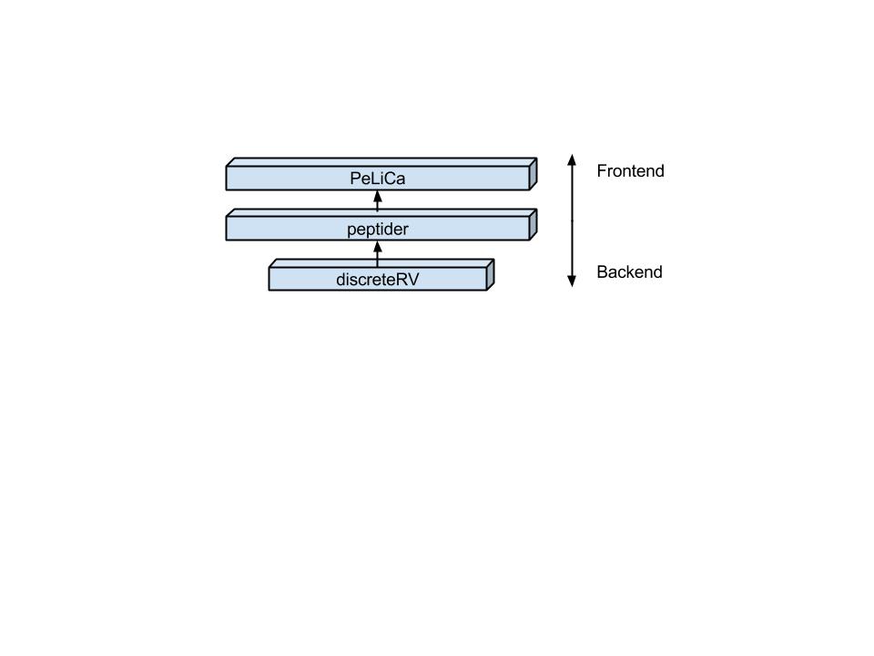
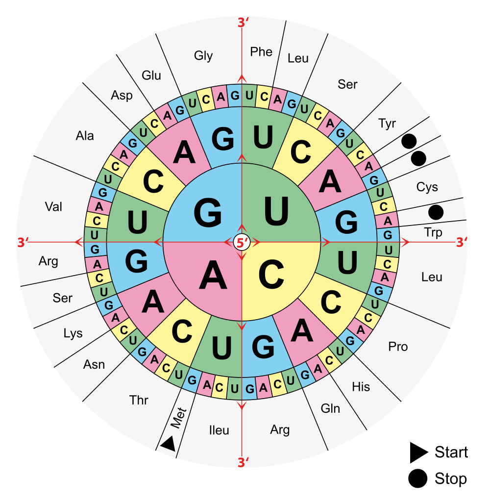

A Framework and Application for Efficient Analysis of Peptide Libraries
========================================================
author: Eric Hare
date: 02-06-2014
font-family: 'Helvetica'

Introduction
========================================================

Peptide Libraries are important in a number of fields for a number of different applications:

- Protein Interaction
- Vaccine Research
- Drug Screening

Problems
========================================================
- Cost - The more peptides, the more expensive
- Quality - The fewer different peptides, the less useful for most applications

Being able to assess the quality of a peptide library, and doing so in a way so as to minimize cost, should help researchers make better choices about which peptide library to purchase.

Framework
========================================================
My project is a three-layer tool to assess the statistical properties of peptide libraries.


discreteRV
========================================================
Manipulation of Discrete Random Variables

Installing discreteRV
========================================================
discreteRV is available on CRAN (stable) and GitHub (development)

(1) Install from CRAN or GitHub

```r
install.packages("discreteRV")

library(devtools)
install_github("discreteRV", "erichare")
```


(2) Load the package

```r
library(discreteRV)
```


Creating discrete random variables
========================================================
Let X be a random variable representing a single toss of a fair die. X takes on the values 1 to 6 with probability $\frac{1}{6}$

$P(X = x) = \frac{1}{6} x \in {1, 2, 3, 4, 5, 6}$

In discreteRV,


```r
X <- make.RV(1:6, rep(1/6, 6), fractions = TRUE)
X
```

```
random variable with 6 outcomes

  1   2   3   4   5   6 
1/6 1/6 1/6 1/6 1/6 1/6 
```


Creating discrete random variables (continued)
========================================================

```r
plot(X)
```


Probability Functions
========================================================
discreteRV features probability functions which have a syntax very similar to Casella & Berger:


```r
P(X > 3)
```

```
[1] 0.5
```

```r
P(X < 1 | X >= 5)
```

```
[1] 0.3333
```


Probability Functions (continued)
========================================================


```r
E(X)
```

```
[1] 3.5
```

```r
V(X)
```

```
[1] 2.917
```

```r
SD(X)
```

```
[1] 1.708
```


Joint Distributions
========================================================
discreteRV allows easy computation of joint distributions:


```r
multN(X, n = 2, fractions = TRUE)
```

```
random variable with 36 outcomes

 1.1  1.2  1.3  1.4  1.5  1.6  2.1  2.2  2.3  2.4  2.5  2.6  3.1  3.2  3.3 
1/36 1/36 1/36 1/36 1/36 1/36 1/36 1/36 1/36 1/36 1/36 1/36 1/36 1/36 1/36 
 3.4  3.5  3.6  4.1  4.2  4.3  4.4  4.5  4.6  5.1  5.2  5.3  5.4  5.5  5.6 
1/36 1/36 1/36 1/36 1/36 1/36 1/36 1/36 1/36 1/36 1/36 1/36 1/36 1/36 1/36 
 6.1  6.2  6.3  6.4  6.5  6.6 
1/36 1/36 1/36 1/36 1/36 1/36 
```


Simulations
========================================================
We can simulate trials from any defined random variable:


```r
X.sim <- rsim(10, X)
X.sim
```

```
1/6 1/6 1/6 1/6 1/6 1/6 1/6 1/6 1/6 1/6 
  6   5   4   4   3   3   4   6   3   1 
attr(,"RV")
random variable with 6 outcomes

  1   2   3   4   5   6 
1/6 1/6 1/6 1/6 1/6 1/6 
attr(,"class")
[1] "RVsim"
```


Simulations (continued)
========================================================


```r
plot(X.sim)
```


An Application of discreteRV
========================================================
Peptides are chains of amino acids linked by peptide bonds



Suppose we regard each amino acid as independent of the others in a peptide...

peptider
========================================================
peptider is an R package, built on top of discreteRV, which allows for the statistical analysis of peptide libraries.

(1) Install from CRAN or GitHub

```r
install.packages("peptider")

library(devtools)
install_github("peptider", "heike")
```


(2) Load the package

```r
library(peptider)
```


PeLiCa
========================================================
Shiny-based web-frontend to peptider
